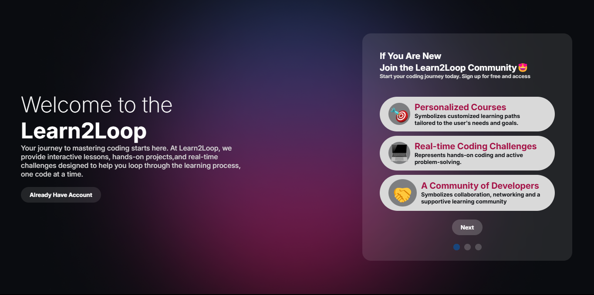
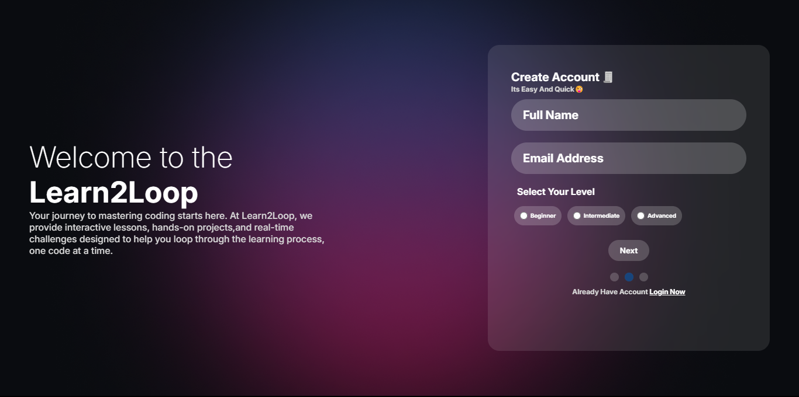
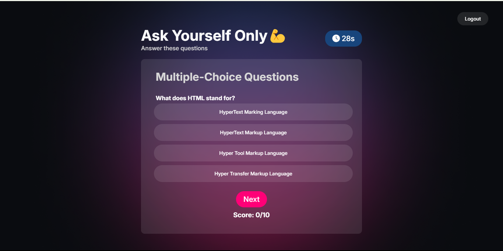
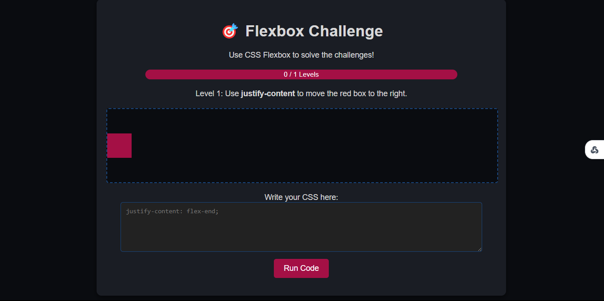

# Learn to Loop - Quiz App
Welcome to Learn to Loop, a quiz app designed for developers to test their skills and challenge their knowledge! 🚀

This app allows developers to take quizzes on different topics related to web development and programming, helping them measure their progress and enhance their skills.

🛠️ **Technologies Used**  
- **HTML**: For structuring the app.  
- **CSS**: For styling the app and making it responsive.  
- **JavaScript**: For interactive functionalities and logic.  
- **Tailwind CSS**: Admin part.  
- **APIs**: To fetch quiz data and handle user interactions.

📈 **How It Works**  
- **Take a Quiz**: Select a quiz category, answer questions, and check your score at the end.  
- **Test Your Skills**: The app is designed to challenge developers of all levels, from beginner to advanced.  
- **Track Your Progress**: Compare your scores with others and track your improvement over time.

⚙️ **Features**  
- **Dynamic Quizzes**: Multiple categories with new quizzes regularly.  
- **Timer**: Each quiz has a timer to track your speed.  
- **Score Tracking**: Check your scores and improve your results with each quiz attempt.  
- **Leaderboard**: Compete with other developers and aim for the top spot.


- **Some Of Website Preview**:  
-   
 - 
 - 

### Challenges Section
We’ve added a new **Challenges** section to the app to make learning even more fun! These challenges test your practical skills and help you learn by doing. Check out the following challenges:

- **Flex Froggy Challenge**:  
  Challenge yourself by using **Flexbox** to move frogs into the correct position.  
  

- **CSS Color Code Challenge**:  
  Match the correct color code by applying CSS.  
  

- **Grid Box Challenge**:  
  Use **CSS Grid** to place elements within a grid layout.  
  

- **CSS Position Challenge**:  
  Experiment with **CSS Positioning** techniques (absolute, relative, fixed, etc.).  
  

### Installation
To run this project locally on your computer, follow these steps:

1. **Clone this repository**:
   ```bash
   git clone https://github.com/dugsiiyeinc/Learn2Loop.git
Navigate to the project directory:

bash
Copy code
cd Learn2Loop
Open index.html in your browser to start using the app.

Contribution
Feel free to contribute to this project by submitting issues or pull requests. If you have any feature requests or improvements in mind, feel free to reach out!

Fork this repository.
Create a new branch (git checkout -b feature-name).
Make your changes and commit them (git commit -am 'Add new feature').
Push to the branch (git push origin feature-name).
Create a new Pull Request.
🌐 Demo
You can view a live demo of the app here: Live Demo

Acknowledgements
GitHub: For providing an excellent platform to host and manage code.
JavaScript Libraries: For their invaluable contributions to making web development easier and more efficient.
My Mentor and Colleagues: For all the support and guidance throughout the project.
📧 Contact
If you have any questions or suggestions, feel free to contact me:

Email: taamir.mm@gmail.com
GitHub: d-i-v7
Thanks for checking out Learn to Loop! Happy coding and good luck with your learning journey! 💻✨

javascript
Copy code

Feel free to copy this text as it is and save it as `README.md` for your project. Simply replac